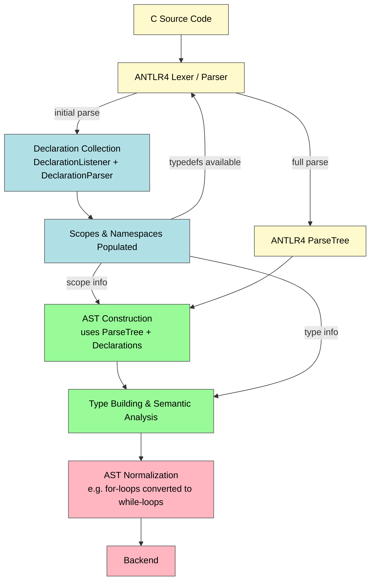

# C on JVM Compiler

# Introduction

conjvm (“C on the JVM”) is an ANTLR4-based experimental C compiler targeting the Java Virtual Machine.
The project explores translating and executing a subset of the C language on the JVM, focusing on compiler construction rather than full language compatibility.

It serves as a hands-on study of compiler technology, including C parsing, AST construction and transformation, intermediate representations (such as SSA), and code generation for the JVM.

The project is not production-ready and intentionally supports only a subset of C. Its goal is learning and experimentation in compiler design, not completeness or performance guarantees.

## Frontend

Frontend architecture overview.
The compiler frontend uses ANTLR4 with a custom declaration-collection phase to correctly handle C typedefs and scope resolution. Typedef information is fed back into parsing to disambiguate between identifiers and typedefs, after which the AST is constructed, type-checked, and normalized.

