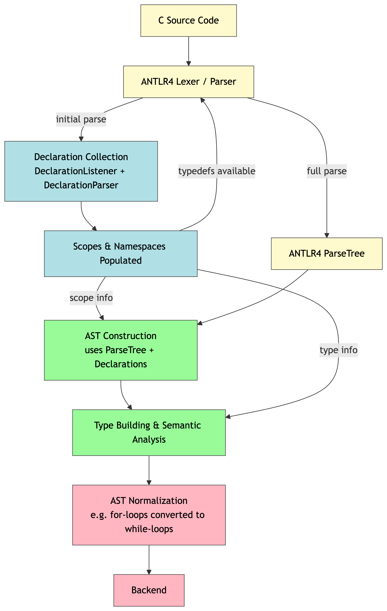

# C on JVM Compiler

# Introduction

conjvm (“C on the JVM”) is an ANTLR4-based compiler for a well-defined subset of the C programming language, targeting execution on the Java Virtual Machine. The compiler translates C source code into JVM-compatible representations, enabling parsing,
semantic analysis, intermediate representation construction, and execution on the JVM.

The project is primarily focused on compiler architecture and language implementation concerns, including grammar design, AST construction and transformation, semantic analysis, intermediate representations (including SSA-style forms), and
JVM-oriented code generation.

conjvm deliberately supports only a restricted subset of C and does not aim for full language compatibility or production use. The scope is intentionally constrained to allow precise reasoning about semantics, design tradeoffs, and implementation
techniques commonly found in real-world compilers.

## Language Scope

Supported C Features:

Explicitly Not Supported:
 
- _Generic

## Frontend architecture overview

The compiler frontend uses ANTLR4 with a custom declaration-collection phase to correctly handle C typedefs and scope resolution. Typedef information is fed back into parsing to disambiguate between identifiers and typedefs, after which the AST is
constructed, type-checked, and normalized.

