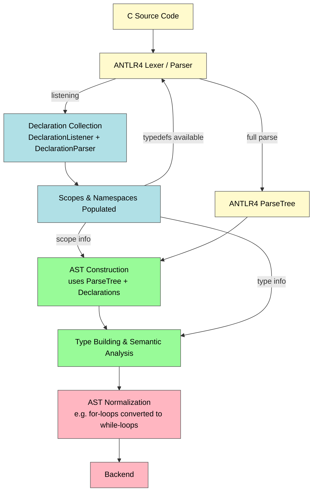

```mermaid
flowchart TD
%% Define Phases Colors (Pastel) with black font
    classDef parserPhase fill:#FFFACD,stroke:#555,stroke-width:1px,color:#000;    %% LemonChiffon
    classDef declPhase fill:#B0E0E6,stroke:#555,stroke-width:1px,color:#000;      %% PowderBlue
    classDef astPhase fill:#98FB98,stroke:#555,stroke-width:1px,color:#000;       %% PaleGreen
    classDef normPhase fill:#FFB6C1,stroke:#555,stroke-width:1px,color:#000;      %% LightPink

%% Nodes
    A[<font color="black">C Source Code</font>]:::parserPhase
B[<font color="black">ANTLR4 Lexer / Parser</font>]:::parserPhase
C[<font color="black">Declaration Collection<br/>DeclarationListener + DeclarationParser</font>]:::declPhase
D[<font color="black">Scopes & Namespaces Populated</font>]:::declPhase
E[<font color="black">ANTLR4 ParseTree</font>]:::parserPhase
F[<font color="black">AST Construction<br/>uses ParseTree + Declarations</font>]:::astPhase
G[<font color="black">Type Building & Semantic Analysis</font>]:::astPhase
H[<font color="black">AST Normalization<br/>e.g. for-loops converted to while-loops</font>]:::normPhase
I[<font color="black">Backend</font><br/>]:::normPhase

%% Arrows with labels
A --> B
B -- listening --> C
C --> D
D -- typedefs available --> B
B -- full parse --> E
D -- scope info --> F
E --> F
F --> G
D -- type info --> G
G --> H
H --> I
```
